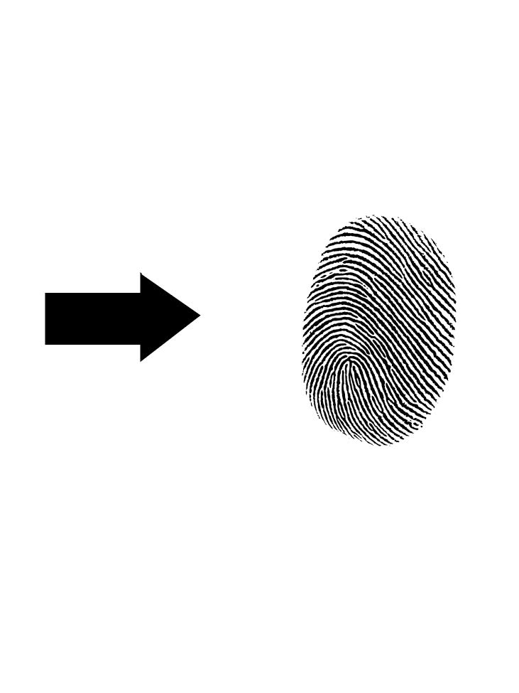
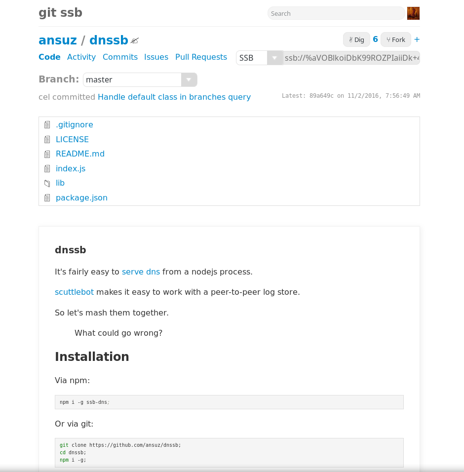
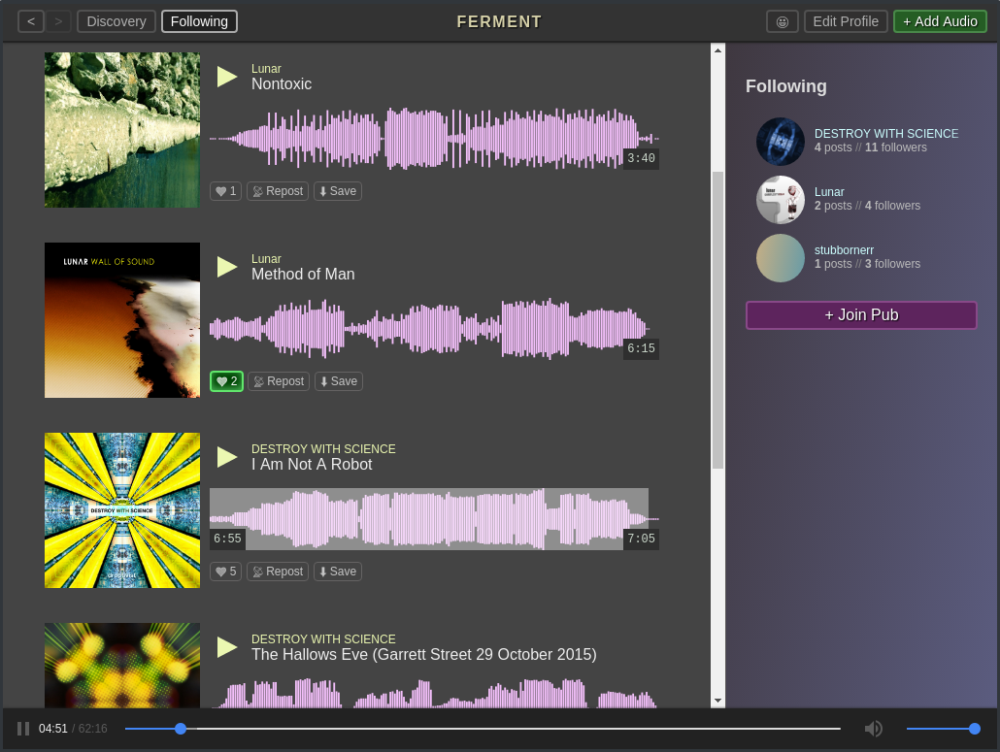

# embracing subjectivity

mix

`@ye+QM09iPcDJD6YvQYjoQc7sLF/IFhmNbEqgdzQo3lQ=.ed25519`

???
## CHECKLIST

- display
- servers
  - views enlarged
  - patchbay
  - git ssb

## what is this talk about?

- the trajectory of the web
- useful primitives for decent tech
- a new hope

---
## organising civilisation


???
## how did humans get where we got?


- recording things that matter

## basically, admin

---
## transactions


???
## how long?

A clay tablet
- sumerians trading grains 5000 years ago
- table

---
## tax documentation


???
## Rosetta stone

tax edict from 2000 year ago

---
## logistics


???
## NATO 

- 45 years ago
- supply logistics + payroll

## amazon

---
## identity


???
## to what degree is defintion of identity linked to instutions?

- checking taxes
- communicating with other orgs 
  - kingdoms backing safe passage 
  - we'll revist this

## notice the imperfections

- name
- gender

## why is this passport the way it is?

---
## institutional legibility


???
- name change: 9 pages + supplementary
- passport name change: 12 pages + supplementary

---
## institutional legibility


???
## photo job > no-one looks good (inaccurate rep)

## what's wrong with this?

- homogeneous
- legible (but not human)

---
## opinions baked in

```js
return knex.schema.createTable('users', function (table) {
  table.string('userName')
  table.string('email')
  table.string('password')
  table.boolean('gender')
})
```

???
## code plays an important part of trend

- records
- rules

## what's wrong with opinions?

- opinions are great
  - cohesion
  - learning
  - great things 

- code enables even more more of the same
  - some table
  - plus built in rules + logic
  - extends

---
## plato


???
## I blame this guy

## objectivity

- holy wars
- medicine

---
## objective truth


???
## trancendental truth

- truth that is above or exists independtly

## opinions >>> objective truths

- handed down from on high

## this is how stuff is

---
## this is you


???
## easy to mistake this document (and it's opinions) for the truth

.

## this is a trivial example

how do you feel about administrative opinions about your:
- gender
- friendships
- loyalty to state
- religion
- health
- race

---
## the good word


???
## an error in reading or writing a text

- objective truth going bad

## what's the alternative?

---
## an alternative


???

## recording + re-presentating info (millenia)

- stories
- recipes
- music 

---
## inter-subjective truths


???


## how is truth stored and re-presented here?
  - a bunch of assertions
  - a lens for interpretation

## what if we could code like this ? 
  - no singular ledger, no prescriptive fields
  - a plurality of ledgers and a plurality of interpretation 

## doesn't sound institutionally legible

---
## build a subjective twitter

a system where: 
  - anyone can speak
  - anyone can interpret the world

???
## read / write / presentation

---
## built!

???
spoilers:
 - it's written and running
 - it's generating, subjective truth 

flash patchbay

---
## scut•tle•butt (skŭtˈl-bŭtˌ)

1. n. Slang Gossip; rumor.
2. n. _Nautical_ A drinking fountain on a ship.
3. n. _Nautical_ A cask on a ship used to hold the day's supply of drinking water.

???

## Gossip

- like stories, messages are gossiped
- remember the stories I've heard locally 

---
## one 'database'

web | scuttlebutt
:---|:---
twitter / fb | patchwork, **patchbay**, patchfoo, decent, ...
git + github | git-ssb
dns | dnssb
soundcloud | ferment
spotify | voltra


???
## many interfaces


---
## important decent primitives

- content addressable storage
- public/ private keys

---
## content addressable storage


???

you've seen these already

---
## content addressable storage




???
## verify right data

## OR requests the exact data

## fingerprints > used to find people

---
## content addressable storage

```js

        hash(file) // => 63ef70b672446094009382b92008feb9b909d443


```

???
## verify right data

## OR requests the exact data

## fingerprints > used to find people

---
## public-private keys

#### signing


???
## mesopatamians 3000 years ago

## public part - everyone knows (like your name)

## private part - only you have (it's for signing)

---
## public-private keys

#### encryption


???
## public part encrypts (hides content)
## private part decrypts (retrieves content)

probably should improve diagram

---
## message

```js
var message = {
  author: '@mixmix',
  content: {
    type: 'post',
    text: 'hope you are enjoying nz.js so far'
  },
  timestamp: 1488613256922
}
```

---
## message - author

```js
var message = {
  author: '@ye+QM09iPcDJD6YvQYjoQc7sLF/IFhmNbEqgdzQo3lQ=.ed25519',
  content: {
    type: 'post',
    text: 'hope you are enjoying nz.js so far'
  },
  timestamp: 1488613256922
}

```

You use your public key as your identity

???
## note author (me) is my public key

---
## message - signing

```js
var message = {
  author: '@ye+QM09iPcDJD6YvQYjoQc7sLF/IFhmNbEqgdzQo3lQ=.ed25519',
  content: {
    type: 'post',
    text: 'hope you are enjoying nz.js so far'
  },
  timestamp: 1488613256922
}

var signedMessage = sign(message, privateKey)
```

You use your private key to sign the message

???
## by include my public key in what is signed

- know who it's from
- can verify signature

---
## message - signed 

```js
var message = {
  author: '@ye+QM09iPcDJD6YvQYjoQc7sLF/IFhmNbEqgdzQo3lQ=.ed25519',
  content: {
    type: 'post',
    text: 'greetings hello nz.js'
  },
  timestamp: 1488613256922
}

var signedMessage = sign(message, privateKey)
```

```js
// signedMessage
{
  author: '@ye+QM09iPcDJD6YvQYjoQc7sLF/IFhmNbEqgdzQo3lQ=.ed25519',
  content: {
    type: 'post',
    text: 'greetings hello nz.js'
  },
  timestamp: 1488613256922,
  signature: 'IBJXJC+DrwuX9iDwPUIJlSHs7BfENtx4D5fkCCT/+M42qhd6....==.sig.ed25519'
}
```

---
## content addressable storage

```js
var signedMessage = {
  author: '@ye+QM09iPcDJD6YvQYjoQc7sLF/IFhmNbEqgdzQo3lQ=.ed25519',
  content: {
    type: 'post',
    text: 'greetings hello nz.js'
  },
  timestamp: 1488613256922,
  signature: 'IBJXJC+DrwuX9iDwPUIJlSHs7BfENtx4D5fkCCT/+M42qhd6....==.sig.ed25519'
}
```

```js
var messageId = hash(signedMessage)
// => %emva3qXR6+XtLKwxWIsVB/hO1i5PmV9v2AP5hjRNDKQ
```
hash produces a unique, verifiable 'finger-print' of our message.

---
## examples - `about`

`%fiidAb7c6qPNtpeNkoeo+wFb+dKqJXEcyuMlT54V3Qg=.sha256`
  
```js
{
  author: "@azsQJqrOazV1/VC2hF5rSylaN4A1lTXPIuer+PdCQ3M=.ed25519",
  content: {
    type: "about",
    about: "@azsQJqrOazV1/VC2hF5rSylaN4A1lTXPIuer+PdCQ3M=.ed25519",
    name: "juliana",
    image: {
      link: "&qgNK+27gf4Rquyh4T7w7wDU0HiUayS+y+1sDlNfI/2g=.sha256",
      size: 452153,
      type: "image/png",
      width: 512,
      height: 512
    }
  },
  timestamp: 1487904949711,
  signature: "ce+JOzOxNdCj7Vkdlgmpd+yKbw4qMpIZLm/54FJdGCMleGOS...."
}
```

???

# this is emergent - show patchbay

---
## patchwork-next


---
## examples - `post`

`%vwCaR1lR02hiiInODqT4OmAgTSwNJ1AbYTYmfTwtXXw=.sha256`

```js
{
  author: "@z8aJVHJTc6MM8FwaNE2GIS3AYYt2HYFNWQUO8/iydNw=.ed25519",
  content: {
    type: "post",
    root: "%TapY6/6ghLYlTdn0pjm7rDLK5kcAhcqJarp9cWrwAvc=.sha256",
    text: "on the old-web I am the product.",
  },
  timestamp: 1488849598356,
  signature: "lVzsUsU42/wynxvTexKeQgjGC7HsJCkOnrr2yUrZbffguAEg..."
}
```

???

## and reply

---
## examples - `git-update`



???
- code is just messages
- github as a fire-side story (I don't have to hang out with a company)

---
## examples - `issue`

???

## git issue

## person issue

---
## examples - `music`



???
- anger driven development
  - creating music, paying for a service that is getting in the way
- ssb for discovery and messaging
- webtorrent for sharing music

---
## there & back again

???
- reverse culture shock

---
## connectivity 


???
## is the internet down?

## islands
- ships
- space

## instant
- git-ssb
- search
  - contrast this to http(2)

---
## top-down UI 

 

???
- re-presenting data 
  - why can't I re-present my own data
- comic sans: article about accessibility of fonts

## no ads

---
## papers please


???
- weird constraints on form filling in

## why would I need to present my papers before I speak?
- not chill 

---
## border control

???
## integrations!

- caught in some object beauracratic paper shuffle

## !erryday conversation

- github + social + music
- free-form interplay
  - possible futures
  - an expressive space

## one group multiple places
  - my identity is not just me, it's my context, my social graph

---


???

- heading to mars /climate-pocalpse, 
  - either way the old-web ain't gonna cut it

- If you're curious, you're most welcome

---
## scuttlebutt.nz

`@ye+QM09iPcDJD6YvQYjoQc7sLF/IFhmNbEqgdzQo3lQ=.ed25519`

`@whimful`

???

---
background-color: black;
color: white;

## embracing subjectivity

.

