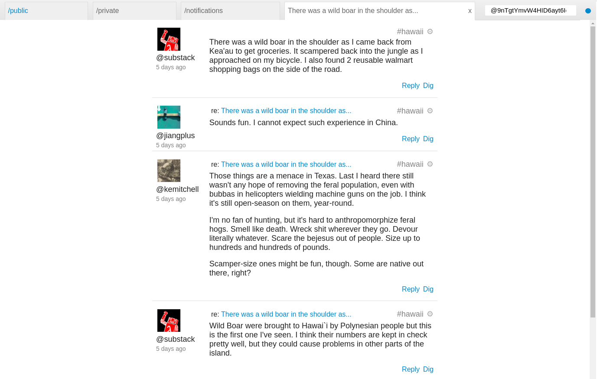

# Embracing Subjectivity

mix irving

@ye+QM09iPcDJD6YvQYjoQc7sLF/IFhmNbEqgdzQo3lQ=.ed25519

???

What I hope you to take away from this: 
- some technical concepts
- some questions about assumed architectures
- a taste for what's possible

---
## Truth

???

This talk is about truth 
  - how it's defined
  - how that definition influences us

---
### Continuum of truth

```
              Truth
                ^
                |
                |
                |
                v
              truth
```

---
## Truth


Idealism | Objectivity | Top-down truth

???

Plato looking for someone to pin this on

He certainly contributed

plato 
  - idealism
  - duality of objective + subjective
  - (object oriented programming!)

---
## Truth


sweet coherence

???

Form enough agreement, build a city, roll out some sick aquaducts + culture
(maybe show how the coherence lead to the belief that the spaniards were gods)

---
## Truth 


dangerous absolutism

???

too close to Truth

trancendental truth
  - the church : that land is holy, we are holy. i'm just gonna take that
  - the vatican : condoms don't protect against H.I.V.
  - the state : give me your ID
  - object oriented programming?


---
## Zero Truth


??? 

- the rennaisance
  - the start of a refactor
  - vestigal Truth : swap out god for other truths (science, medicine, databases)
- turn that Truth down
  - kill god
  - nihilism
  - personal freedom - century of the self

---
## truth


Subjectivity | bottom-up truth | inter-subjective truth | relativism 


---
## truth in modernity

We have quite a lot of Truth

Identity
  - formal : 
    - tracking authorisation, coordinating society
    - passports, bank identities
    - user tables
  - informal identity 
    - friendship, nicknames
    - trust

- corporations interested in the informal identity
  - because it's about the emergent truth BETWEEN users

Transactions
  - formal
  - informal


???

- All quite top-down
- computers are declarative lend, themselves to Truth
  - some of the early mainframes were just big accounting, resource, tax, state systems
- who authors the Truth?
- who holds sovereinty over that Truth?

---
## more subjective computing

decoupling Truth from institution
- bitcoin
- namecoin
- diaspora
- git


???

- lots of our tech is quite Truth / Objective

---
## MORE subjective

Design challenge

Build (twitter) without a central server

???

- no federated servers (gnu-social / diaspora)

---
background-image: url(island_replication.jpeg)
background-color: black
color: white

## Why care?

???

- mad science
- no servers = different internet
  - islands (boats, inland, off-world) 
  - disasters
  - social/ political


---
## Patchbay 



???

- it exists
- it is very different to the internet you know
  - this is a system which behaves _like a group of humans_
    - very messy
    - anti-fragile


- each user 
  - has freedom of speech
  - can only see so far
  - has their own perspective
  - sovereinty over their experience

- applications are all part of the same space
  - github and patchbay

---
## challenges, solutions, & side effects

???

as explored through scuttlebutt

challenges
  - identity
  - authorisation
  - meaning 
technology needed to help

- interesting parts 
  - challenges, learnings, funny noticings
  - _spoiler_ - the more we build, the more we see a system that looks  like 'people space' / offline-world / like human society has for millenia.
    - **either** similar constraints lead to similar dynamics
    - **or** the shape of it makes it easy to pour social intuitions into 

- moving away fom capital T truth -> subjectivity 

---


Alt arc - 

this is a story about truth

TRUTH (plato)  - there's this duality, this absolute perfect truth
CHURCH (god) - there's this truth
SCIENCE - there is truth

There is no truth - nihilism, post-modernism, the individual

FACEBOOK - here's some political truth / the truth about what's important


There has always been truth - it's just not in the individual or the trancendental or holy 


---


